This project uses data from a [Dungeons & Dragons API](https://www.dnd5eapi.co/) to create visualizations of some of the different patterns in spell distribution within the game system, specifically its 5th edition (2014). 

D&D is the most popular tabletop roleplaying game (TTRPG) on the market. This is due in part to its Open Gaming License, which gives third parties blanket permission to create their own game supplements based on the D&D's fundamental mechanics. These fundamental mechanics are detailed in something called the System Reference[System Reference Document](https://www.dndbeyond.com/srd), or SRD. 

This project looks specifically at the spells portion of that content. There are 319 spells in the SRD, each with its own set of rules, including which of the eight included spellcasting class(es) (i.e. wizard, cleric, druid, etc.) can cast that spell; what school of magic (i.e. transmutation, illusion, necromancy, etc.) the spell belongs to; and how powerful the spell is, i.e. its numbered level (0-9). It uses visualizations to explore several questions:
<br>

### 1. Do some classes have access to more high-level spells than others?

### 2. Are some schools of magic concentrated among specific classes?

### 3. Is there a relationship between spell level and school of magic?

<br>
***

## How does the project work?

It uses the [5e API](https://www.dnd5eapi.co/) to pull the following data for each of the 319 spells: spell name, spell level, spell school, class, and subclass. It assigns the correct class to each subclass and the subclass "all" to each class. With the help of the pandas library, these data are then assembled into a dataframe.

```
df = pd.DataFrame({
    'Spell Name' : spellname,
    'Spell Level': spelllevel,
    'Spell School' : spellschool,
    'Class' : spellclass,
    'Subclass' : spellsubclass
})
```
<br>
In the SRD, each class has only one subclass. This was always going to make subclass data only moderately useful, but mid-project, it was discovered that subclass data in this API was unreliable: every single spell was designated "lore," the SRD bard subclass. This is due to the combination of a bard feature called "Magical Secrets," which gives bards limited access to every spell in the game, plus an error, which is attributing this only to the lore subclass rather than the bard class as a whole. This does preserve the integrity of the bard data—-spells tagged "bard" are all on the core bard spell list--but makes the subclass data less useful for this project's purposes. 

As such, the code filters the data to include only the data for the classes' spell lists:

```
classSpellLists = df[df['Subclass'] == 'all']

```

This forms the basis for the rest of the data manipulation, which is explained in collapsed sections below.  
<br>
<br>

## What spells exist?

Before delving into the specifics of spell distribution across classes and schools of magic, it makes sense to look at how many spells exist at each level and within each school of magic.

First, a CSV file containing spell name, spell level, spell school, and class is available for download [here](/assets/class_spell_lists.csv). This only accounts for each class's basic spell lists and does not address bards' access to Magical Secrets, nor any subclass-specific access to spells.
<br>

<br>
<br>
<br>
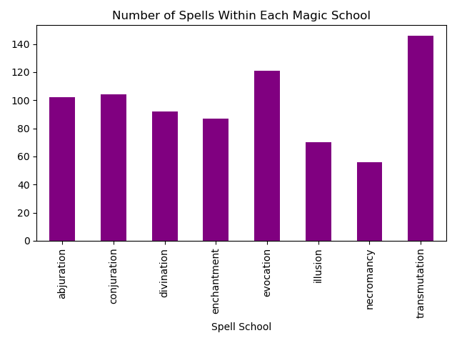
<br>
<br>
<details>
<summary><i>>Click for code information</i></summary>

To create these graphs, the code pulls the spell level data, counts the number of instances of each level, and sorts this information into a dataframe useable for creating a bar graph.

<pre>
<code>
spellcounts = classSpellLists['Spell Level'].value_counts()
sortedspellcounts = spellcounts.sort_index()

levelGraph = sortedspellcounts.plot(kind = "bar", title = "Number of Spells of Each Level")
</code>
</pre>

Through a similar process, it pulls and sorts the number of spells that exist in each spell school.

<pre>
<code>
spellcountsschool = classSpellLists['Spell School'].value_counts()
sortedspellcountsschool = spellcountsschool.sort_index()

schoolGraph = sortedspellcountsschool.plot(kind = "bar", title = "Number of Spells Within Each Magic School", color = "purple")
</code>
</pre>
</details>
<br>
<br>
<br>

## 1. Do some classes have access to more high-level spells than others?

These graphs show the number of spells of each level available to full casters. Level 0 signifies cantrips. 
<br>
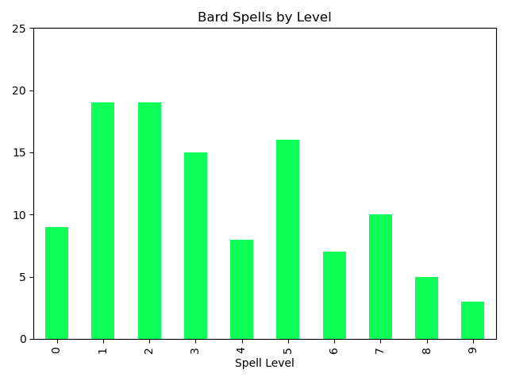
<br>
<br>
<br>

<br>
<br>
<br>
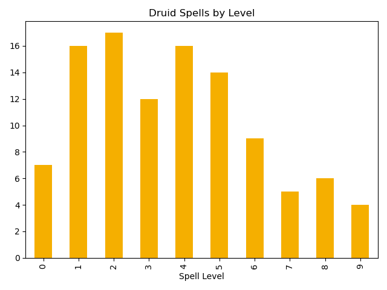
<br>
<br>
<br>
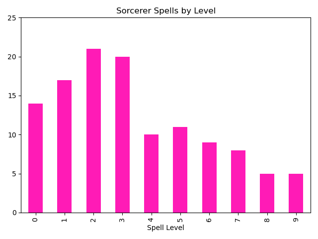
<br>
<br>
<br>
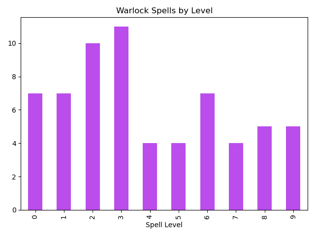
<br>
<br>
<br>


And of course, our half-casters:
<br>
<br>
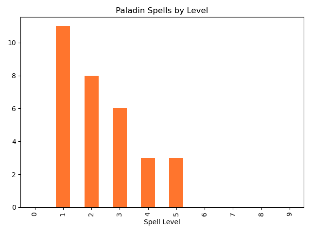
<br>
<br>
<br>
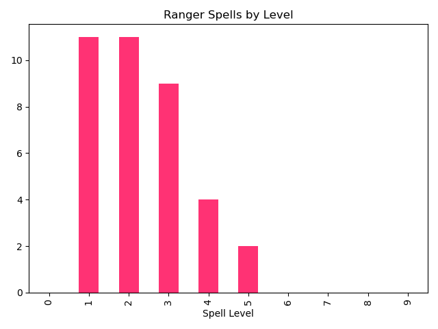

Below is a comparison between all eight spellcasting classes. Click [here](assets/images/class_spell_graph-1.png) for a larger view. 
<br>
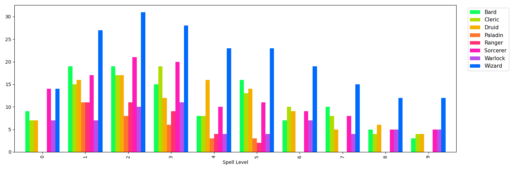 
<br>
<br>
<details>
<summary><i>>Click for code information</i></summary>

To create these graphs, the code pulls only the rows containing bard spells, gathers the rest of the data for those rows, counts how many rows there are for each spell level, and sorts those data, yielding a dataframe that can be used to create a graph of how many spells of each level are on the bard spell list. 

<pre>
<code>
bard = classSpellLists['Class'] == 'bard'
bardSpells = classSpellLists[bard].value_counts('Spell Level').sort_index()

bardGraph = bardSpells.plot(kind = "bar", title = "Bard Spells by Level", color = "#0eff58")
plt.ylim(0, 25) 
</code>
</pre>
(It also sets a y axis limit that avoids the y-axis labels from being broken down into 0.5s.)

It does the same for the other classes, adding in null rows where no data exists:

<pre>
<code>
paladinSpells = classSpellLists[paladin].value_counts('Spell Level').sort_index()
paladinSpells[int(0)] = 0
paladinSpells[int(6)] = 0
paladinSpells[int(7)] = 0
paladinSpells[int(8)] = 0
paladinSpells[int(9)] = 0
paladinSpells = paladinSpells.sort_index()

paladinGraph = paladinSpells.plot(kind = "bar", title = "Paladin Spells by Level", color = "#ff752d")
</code>
</pre>

To create a dataframe that re-combines all of these data into the basis for a multiple bar graph setting the eight graphs alongside each other, the function <pre><code>pd.merge</code></pre> is used.

<pre>
<code>
combined_df = pd.merge(bardSpells, clericSpells, on='Spell Level')
combined_df = pd.merge(combined_df, druidSpells, on='Spell Level')
combined_df.columns = ['Bard', 'Cleric', 'Druid']
combined_df = pd.merge(combined_df, paladinSpells, on='Spell Level')
combined_df.columns = ['Bard', 'Cleric', 'Druid', 'Paladin']
combined_df = pd.merge(combined_df, rangerSpells, on='Spell Level')
combined_df.columns = ['Bard', 'Cleric', 'Druid', 'Paladin', 'Ranger']
combined_df = pd.merge(combined_df, sorcererSpells, on='Spell Level')
combined_df.columns = ['Bard', 'Cleric', 'Druid', 'Paladin', 'Ranger', 'Sorcerer']
combined_df = pd.merge(combined_df, warlockSpells, on='Spell Level')
combined_df.columns = ['Bard', 'Cleric', 'Druid', 'Paladin', 'Ranger', 'Sorcerer', 'Warlock']
combined_df = pd.merge(combined_df, wizardSpells, on='Spell Level')
combined_df.columns = ['Bard', 'Cleric', 'Druid', 'Paladin', 'Ranger', 'Sorcerer', 'Warlock', 'Wizard']

combinedSpellGraph = combined_df.plot(kind = "bar", figsize = (15, 5), width = 0.8, color = ["#0eff58", "#b1dc00", "#f5af00", "#ff752d","#ff3274","#ff1bb6","#ba4deb","#006aff"])
plt.legend(bbox_to_anchor=(1.02, 1), loc='upper left', prop={'size': 11})
</code>
</pre>
The graph code includes details that shift the location of the key.

</details>
<br>
<br>
I've also generated a set of graphs showing the schools of spells accessible to only one class, accessible to two classes, etc., going all the way up to seven classes (no spells were accessible to all eight casting classes).

<br>
<br>
<br>

<br>
<br>
<br>

<br>
<br>

<br>
<br>
<br>

<br>
<br>
<br>

<br>
<br>
<br>

<br>
<br>
<br>
This graph sets the data from the above graphs side-by-side, allowing for an overall view of the data. Click [here](assets/images/allschools_graph-2.png) for a larger view. 
<br>
<br>

<br>
<br>
<details>
<summary><i>>Click for code information</i></summary>

The original dataframe contains one row for each spell for each class, so to determine how many spells of each school are available to how many classes, the code counts how many times each spell name occurs: 

<pre>
<code>
numberOfClasses = classSpellLists.value_counts('Spell Name')
</code>
</pre>

...yielding the following data:

<pre>
<code>
> Spell Name
> Detect Magic         7
> Dispel Magic         7
> Hold Person          6
> Locate Creature      6
> Locate Object        6
>                     ..
> Meld Into Stone      1
> Maze                 1
> Mass Healing Word    1
> Mass Heal            1
> Acid Arrow           1
> Name: count, Length: 319, dtype: int6
</code>
</pre>

...which is then itself counted (for the number of spells available to exactly seven classes, etc.) and sorted. 

<pre>
<code>
classesPerSpell = numberOfClasses.value_counts().sort_index()
</code>
</pre>


The code then re-merges the numberOfClasses list with the spell name data and drops superfluous information to leave a dataframe containing spell name, the classes count for each spell, and the school of magic for each spell.

<pre>
<code>
combined_df = pd.merge(numberOfClasses, classSpellLists, on='Spell Name')
combined_df = combined_df.drop_duplicates(subset=['Spell Name'])
combined_df = combined_df.drop(columns = ['Class', 'Subclass', 'Spell Level'])
</code>
</pre>

It then pulls only the spells available to exactly one class and counts how many there are of each spell school, yielding a dataframe that can be used to create a graph of how many of the spells available to exactly one class belong to each school of magic. 

<pre>
<code>
oneclass = combined_df['count'] == 1
oneSchool = combined_df[oneclass].value_counts('Spell School').sort_index()

oneSchoolPlot = oneSchool.plot(kind = "bar", title = "Spells Accessible to Exactly One Class", color = "#005177")
</code>
</pre>

It does the same for the rest of the data, again adding in null rows where no data exists (and setting a y-limit on the graph to avoid half-integer labels):

<pre>
<code>
fiveSchools = combined_df[fiveclasses].value_counts('Spell School').sort_index()
fiveSchools['illusion'] = 0
fiveSchools['necromancy'] = 0
fiveSchools = fiveSchools.sort_index()

fiveSchoolsPlot = fiveSchools.plot(kind = "bar", title = "Spells Accessible to Exactly Five Classes", color = "#f95882")
plt.ylim(0, 5) 
</code>
</pre>

Here, too, to create a dataframe that re-combines all of these data into the basis for a multiple bar graph setting the eight graphs alongside each other, the function ```pd.merge``` is used.

combineddf = pd.merge(oneSchool, twoSchools, on='Spell School')
combineddf = pd.merge(combineddf, threeSchools, on='Spell School')
combineddf.columns = ['1 Class', '2 Classes', '3 Classes']
combineddf = pd.merge(combineddf, fourSchools, on='Spell School')
combineddf.columns = ['1 Class', '2 Classes', '3 Classes', '4 Classes']
combineddf = pd.merge(combineddf, fiveSchools, on='Spell School')
combineddf.columns = ['1 Class', '2 Classes', '3 Classes', '4 Classes', '5 Classes']
combineddf = pd.merge(combineddf, sixSchools, on='Spell School')
combineddf.columns = ['1 Class', '2 Classes', '3 Classes', '4 Classes', '5 Classes', '6 Classes']
combineddf = pd.merge(combineddf, sevenSchools, on='Spell School')
combineddf.columns = ['1 Class', '2 Classes', '3 Classes', '4 Classes', '5 Classes', '6 Classes', '7 Classes']

combinedGraph = combineddf.plot(kind = "bar", figsize = (15, 5), width = 0.8, title = "For each school of magic, how many spells are specialized vs. widely available? ",  color = ["#005177","#455b9b","#895bac","#ca55a3","#f95882","#ff7652","#ffa600"])
legend = plt.legend(bbox_to_anchor=(1.02, 1), loc='upper left', prop={'size': 11})
legend.set_title("Exact number of classes \n that can cast each spell")
</details>
<br>
<br>
<br>

## 2. Are some schools of magic concentrated among specific classes?
<br>
These graphs show the number of spells from each school of magic available to each spellcasting class. 
<br>
<br>
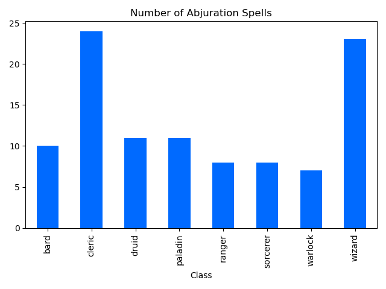
<br>
<br>
<br>
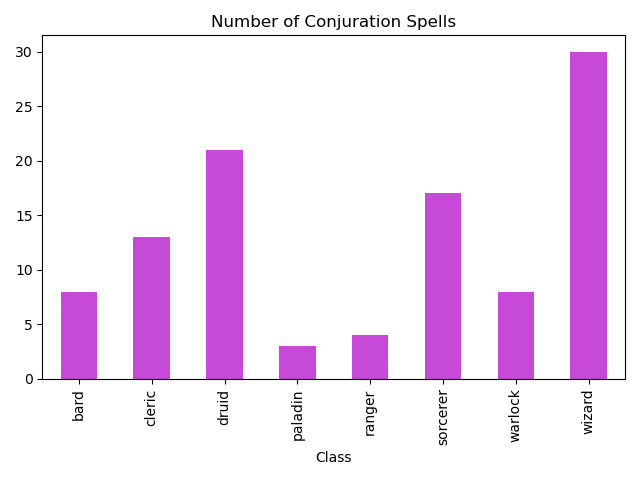
<br>
<br>
<br>
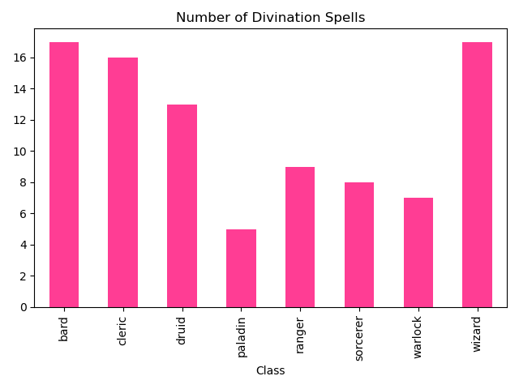
<br>
<br>
<br>

<br>
<br>
<br>

<br>
<br>
<br>

<br>
<br>
<br>
<br>
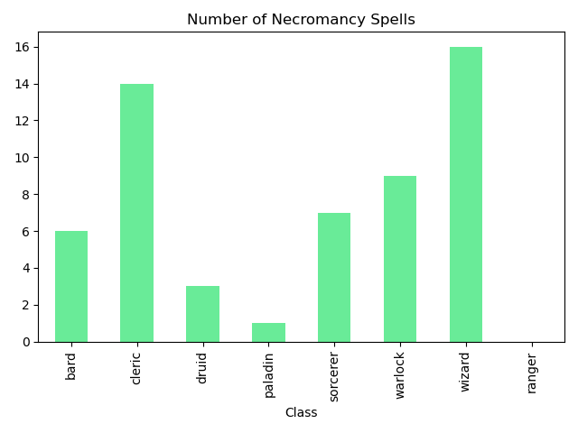
<br>
<br>
<br>

<br>
<br>
<br>
Below is a comparison between the different spell schools grouped by class. Click [here](assets/images/combined_graph-1.png) for a larger view. 
<br>
<br>
<details>
<summary><i>>Click for code information</i></summary>

To create these graphs, the code pulls only the rows containing abjuration spells, gathers the rest of the data for those rows, counts how many rows there are for each class, and sorts those data, yielding a dataframe that can be used to create a graph of how many spells of each school each class has:

<pre>
<code>
abjuration = classSpellLists['Spell School'] == 'abjuration'
abjurationClassSchool = classSpellLists[abjuration].value_counts('Class').sort_index()
</code>
</pre>

Again,  to create a dataframe that re-combines all of these data into the basis for a multiple bar graph setting the eight graphs alongside each other, the function ```pd.merge``` is used.
</details>


<br>
<br>
<br>

## 3. Is there a relationship between spell level and school of magic?
<br>
These graphs show the distribution of spell schools at each spell level.
<br>

<br>
<br>
<br>

<br>
<br>
<br>

<br>
<br>
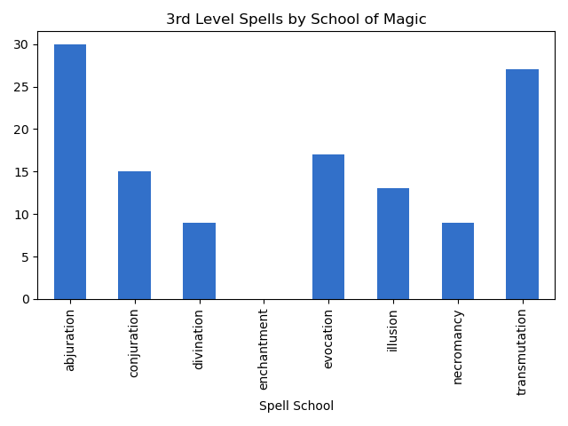
<br>
<br>
<br>

<br>
<br>
<br>
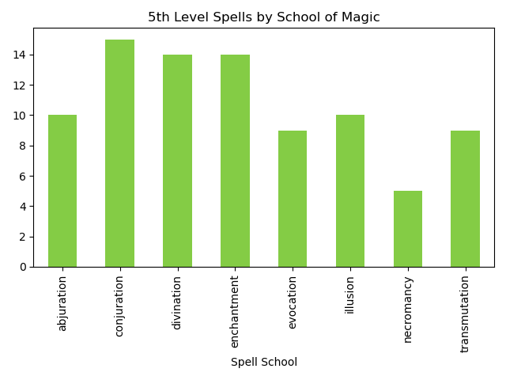
<br>
<br>
<br>

<br>
<br>
<br>

<br>
<br>
<br>

<br>
<br>
<br>
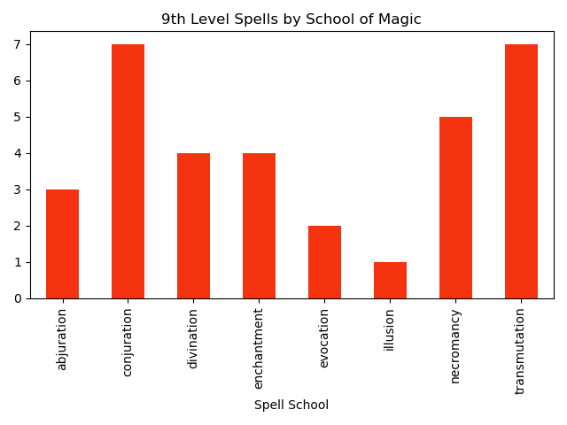
<br>
<br>
<details>
<summary><i>>Click for code information</i></summary>

To create these graphs, the code pulls only the rows containing cantrips, gathers the rest of the data for those rows, counts how many rows there are for each spell school, and sorts those data, yielding a dataframe that can be used to create a graph of how many spells of each school exist at each spell level:

<pre>
<code>
cantrip = classSpellLists['Spell Level'] == 0
cantripSchools = classSpellLists[cantrip].value_counts('Spell School').sort_index()
```
Again,  to create a dataframe that re-combines all of these data into the basis for a multiple bar graph setting the eight graphs alongside each other, the function ```pd.merge``` is used.
</details>
</code>
</pre>

Below is a version that shows the distribution of the spells in each class. Click [here](assets/images/all_lvls_graph.png) for a larger view. 
<br>
<br>


