This project uses data from a [Dungeons & Dragons API](https://www.dnd5eapi.co/) to create visualizations of some of the different patterns in spell distribution within the game system, specifically its 5th edition (2014). 

D&D is the most popular tabletop roleplaying game (TTRPG) on the market. This is due in part to its Open Gaming License, which gives third parties blanket permission to create their own game supplements based on the D&D's fundamental mechanics. These fundamental mechanics are detailed in something called the System Reference[System Reference Document](https://www.dndbeyond.com/srd), or SRD. 

This project looks specifically at the spells portion of that content. There are 319 spells in the SRD, each with its own set of rules, including which of the eight included spellcasting class(es) (i.e. wizard, cleric, druid, etc.) can cast that spell; what school of magic (i.e. transmutation, illusion, necromancy, etc.) the spell belongs to; and how powerful the spell is, i.e. its numbered level (0-9). It uses visualizations to explore several questions:

> **1. Do some classes have access to more high-level spells than others?**
>
> **2. Are some schools of magic concentrated among specific classes?**
>
> **3. Is there a relationship between spell level and school of magic?**
>
 

## What spells exist?

Before delving into the specifics of spell distribution across classes and schools of magic, it makes sense to look at how many spells exist at each level and within each school of magic.

First, a CSV file containing spell name, spell level, spell school, and class is available for download [here](/assets/class_spell_lists.csv). This only accounts for each class's basic spell lists and does not address bards' access to Magical Secrets, nor any subclass-specific access to spells.

## 1. Do some classes have access to more high-level spells than others?

These graphs show the number of spells of each level available to full casters. Level 0 signifies cantrips. 

 
 
 
 

And of course, our half-casters:

  

Below is a comparison between all eight spellcasting classes. 

I've also generated a set of graphs showing the schools of spells accessible to only one class, accessible to two classes, etc., going all the way up to seven classes (no spells were accessible to all eight casting classes).
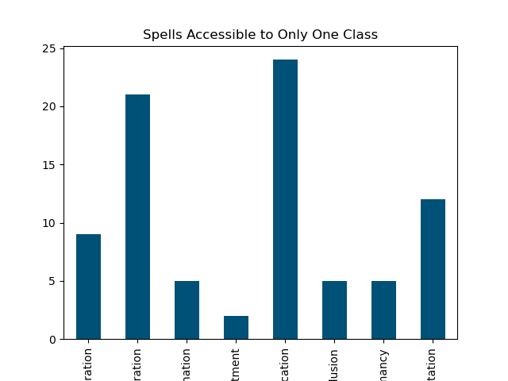
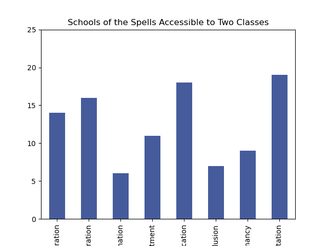 
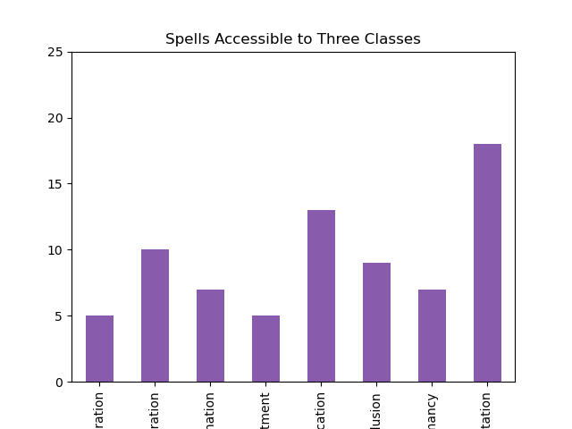 
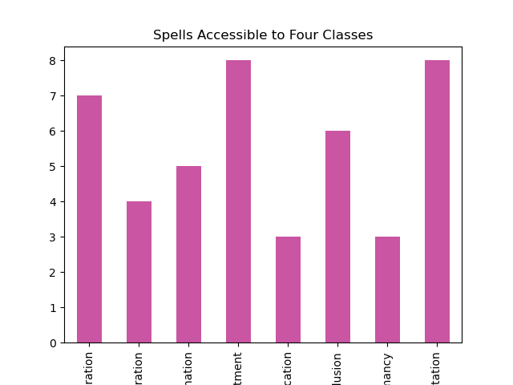 
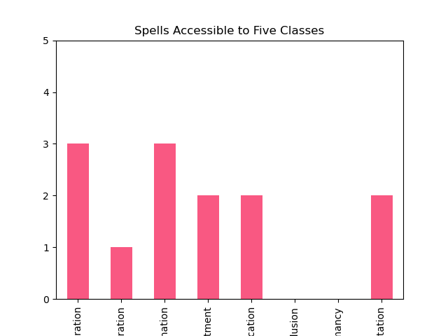 
 
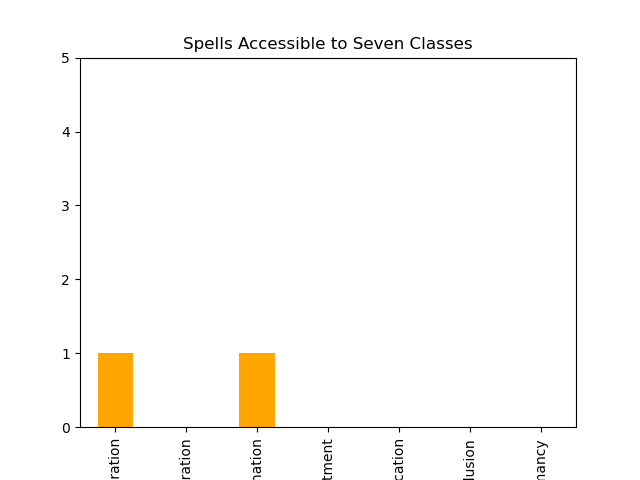 

This graph sets the data from the above graphs side-by-side, allowing for an overall view of the data.
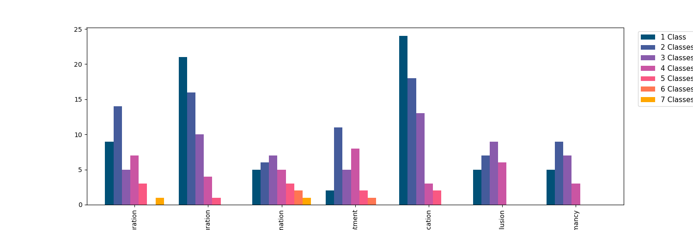 

## 2. Are some schools of magic concentrated among specific classes?

These graphs show the number of spells from each school of magic available to each spellcasting class. 

 
 

  

Below is a comparison between the different spell schools grouped by class.
   

## 3. Is there a relationship between spell level and school of magic?

These graphs show the distribution of spell schools at each spell level.
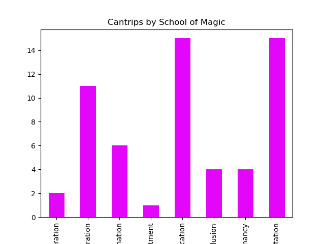
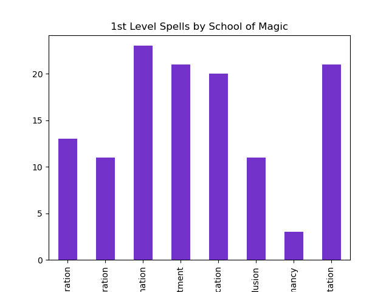 
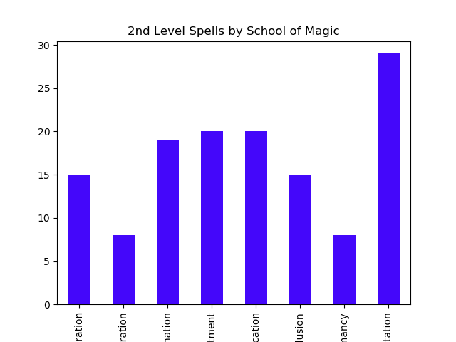 
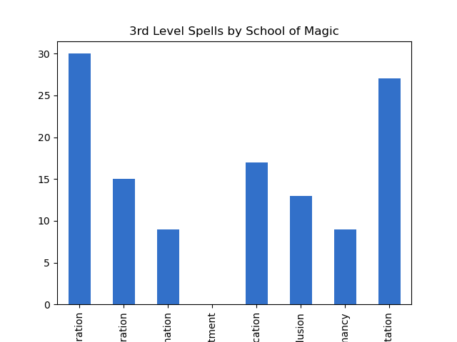 
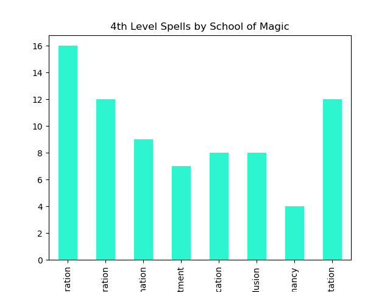 
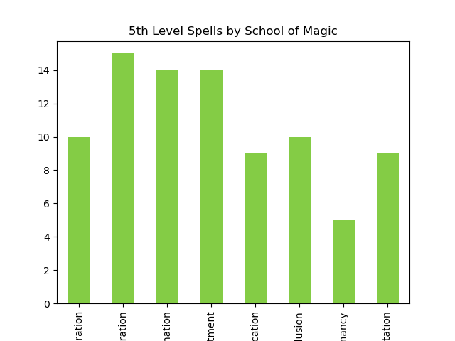 
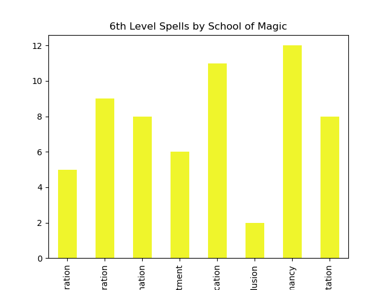 
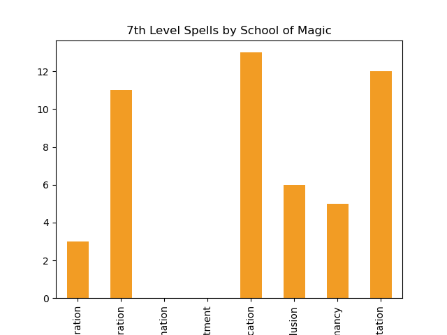 
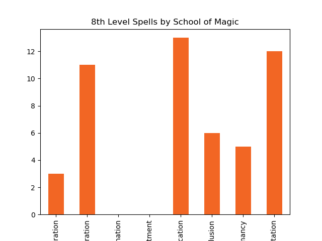 

Below is a version that shows the spell school 

#### Header 4
##### Header 5
###### Header 6
### There's a horizontal rule below this.

* * *

