This project uses data from a [Dungeons & Dragons API](https://www.dnd5eapi.co/) to create visualizations of some of the different patterns in spell distribution within the game system, specifically its 5th edition (2014). 

D&D is the most popular tabletop roleplaying game (TTRPG) on the market. This is due in part to its Open Gaming License, which gives third parties blanket permission to create their own game supplements based on the D&D's fundamental mechanics. These fundamental mechanics are detailed in something called the System Reference[System Reference Document](https://www.dndbeyond.com/srd), or SRD. 

This project looks specifically at the spells portion of that content. There are 319 spells in the SRD, each with its own set of rules, including which of the eight included spellcasting class(es) (i.e. wizard, cleric, druid, etc.) can cast that spell; what school of magic (i.e. transmutation, illusion, necromancy, etc.) the spell belongs to; and how powerful the spell is, i.e. its numbered level (0-9). It uses visualizations to explore several questions:
<br>

### 1. Do some classes have access to more high-level spells than others?

### 2. Are some schools of magic concentrated among specific classes?

### 3. Is there a relationship between spell level and school of magic?

<br>
***

## How does the project work?

It uses the [5e API](https://www.dnd5eapi.co/) to pull the following data for each of the 319 spells: spell name, spell level, spell school, class, and subclass. It assigns the correct class to each subclass and the subclass "all" to each class. With the help of the pandas library, these data are then assembled into a dataframe.

```
df = pd.DataFrame({
    'Spell Name' : spellname,
    'Spell Level': spelllevel,
    'Spell School' : spellschool,
    'Class' : spellclass,
    'Subclass' : spellsubclass
})
```
<br>
In the SRD, each class has only one subclass. This was always going to make subclass data only moderately useful, but mid-project, it was discovered that subclass data in this API was unreliable: every single spell was designated "lore," the SRD bard subclass. This is due to the combination of a bard feature called "Magical Secrets," which gives bards limited access to every spell in the game, plus an error, which is attributing this only to the lore subclass rather than the bard class as a whole. This does preserve the integrity of the bard data—-spells tagged "bard" are all on the core bard spell list--but makes the subclass data less useful for this project's purposes. 

As such, the code filters the data to include only the data for the classes' spell lists:

```
classSpellLists = df[df['Subclass'] == 'all']

```

This forms the basis for the rest of the data manipulation.
<br>
<br>

## What spells exist?

Before delving into the specifics of spell distribution across classes and schools of magic, it makes sense to look at how many spells exist at each level and within each school of magic.

First, a CSV file containing spell name, spell level, spell school, and class is available for download [here](/assets/class_spell_lists.csv). This only accounts for each class's basic spell lists and does not address bards' access to Magical Secrets, nor any subclass-specific access to spells.

Then, to gather the data necessary to create relevant graphs, the code pulls the spell level data, counts the number of instances of each level, and sorts this information into a dataframe useable for creating a bar graph.

```
spellcounts = classSpellLists['Spell Level'].value_counts()
sortedspellcounts = spellcounts.sort_index()

levelGraph = sortedspellcounts.plot(kind = "bar", title = "Number of Spells of Each Level")
```

Through a similar process, it pulls and sorts the number of spells that exist in each spell school.

```
spellcountsschool = classSpellLists['Spell School'].value_counts()
sortedspellcountsschool = spellcountsschool.sort_index()

schoolGraph = sortedspellcountsschool.plot(kind = "bar", title = "Number of Spells Within Each Magic School", color = "purple")
```
The results:

<br>

<br>
<br>
There are the most second-level spells, followed closely by 1st and 3rd. There are the fewest 8th and 9th level spells.
<br>
<br>
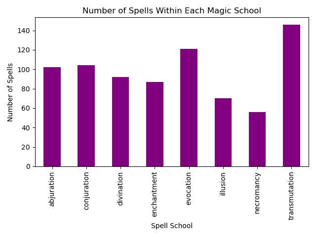
<br>
<br>
There are far and away more transmutation spells than any other school, with evocation in second place. There are the fewest necromancy spells, followed by illusion.
<br>
<br>
<br>

## 1. Do some classes have access to more high-level spells than others?

To answer this question, the code pulls only the rows containing bard spells, gathers the rest of the data for those rows, counts how many rows there are for each spell level, and sorts those data, yielding a dataframe that can be used to create a graph of how many spells of each level are on the bard spell list. 

```
bard = classSpellLists['Class'] == 'bard'
bardSpells = classSpellLists[bard].value_counts('Spell Level').sort_index()

bardGraph = bardSpells.plot(kind = "bar", title = "Bard Spells by Level", color = "#0eff58")
plt.ylim(0, 25) 
```

It does the same for the other classes, adding in null rows where no data exists:

```
paladinSpells = classSpellLists[paladin].value_counts('Spell Level').sort_index()
paladinSpells[int(0)] = 0
paladinSpells[int(6)] = 0
paladinSpells[int(7)] = 0
paladinSpells[int(8)] = 0
paladinSpells[int(9)] = 0
paladinSpells = paladinSpells.sort_index()

paladinGraph = paladinSpells.plot(kind = "bar", title = "Paladin Spells by Level", color = "#ff752d")
```

These graphs show the number of spells of each level available to full casters, with level 0 signifying cantrips. They are broadly similar, with the exception of the half-casters (paladin and ranger), which only have spells of levels 1-5. In general, fourth-level spells show the most variation in number from class to class.
<br>
<br>
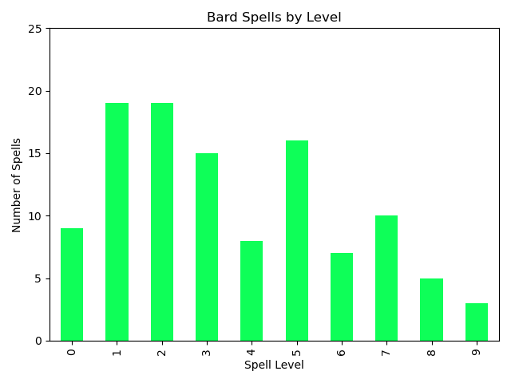
<br>
<br>
<br>
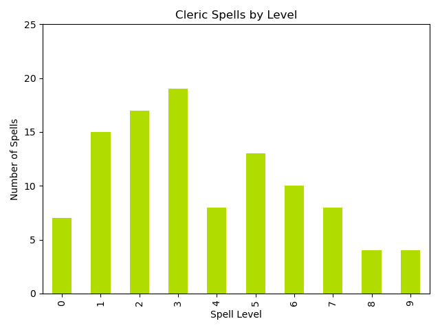
<br>
<br>
<br>

<br>
<br>
<br>

<br>
<br>
<br>
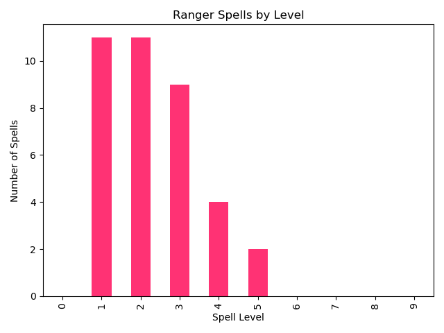
<br>
<br>
<br>
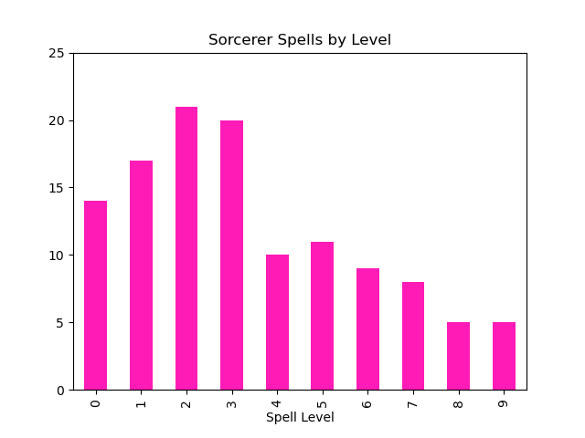
<br>
<br>
<br>
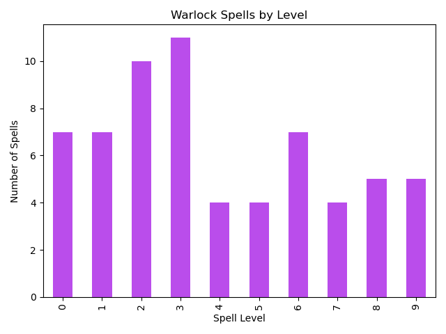
<br>
<br>
<br>
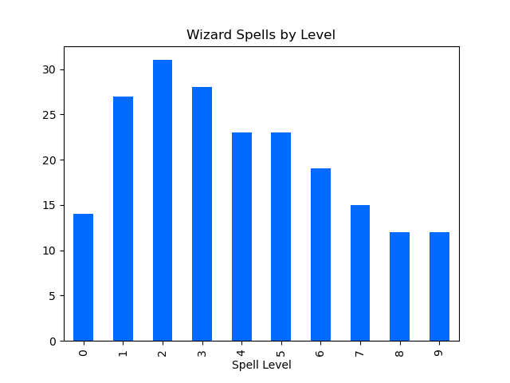


To create a dataframe that re-combines all of these data into the basis for a multiple bar graph setting the eight graphs alongside each other, the function ```pd.merge``` is used. 

The resulting graph shows the advantage held by wizards when it comes to number of available spells!
<br>
<br>
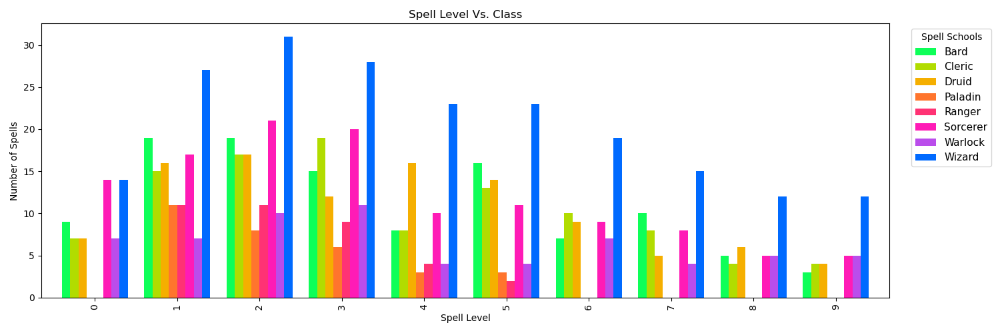
<br>
Click [here](assets/images/class_spell_graph.png) for a larger view. 
<br>
<br>
<br>


## 2. Are some schools of magic concentrated among specific classes?
<br>
These graphs show the number of spells from each school of magic available to each spellcasting class. 
<br>
<br>
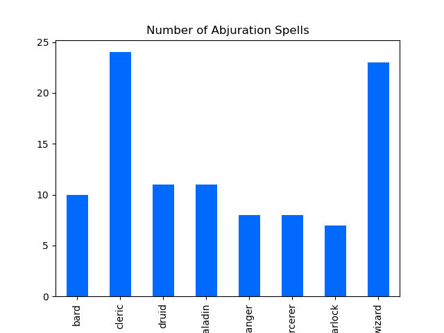
<br>
<br>
<br>
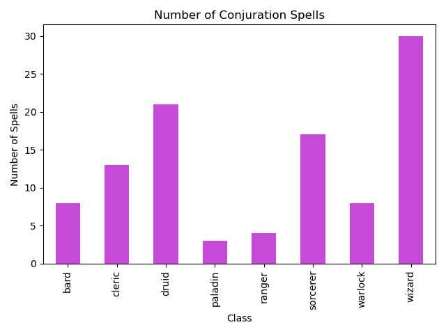
<br>
<br>
<br>
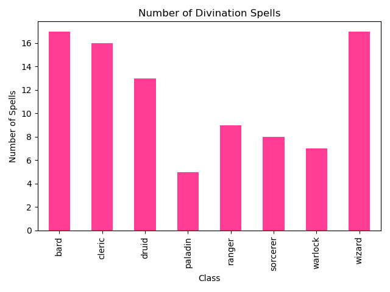
<br>
<br>
<br>
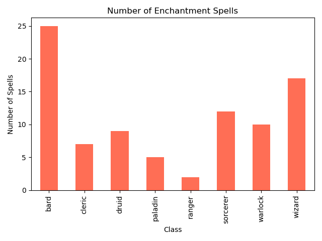
<br>
<br>
<br>
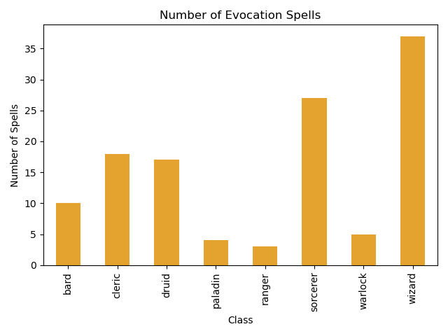
<br>
<br>
<br>
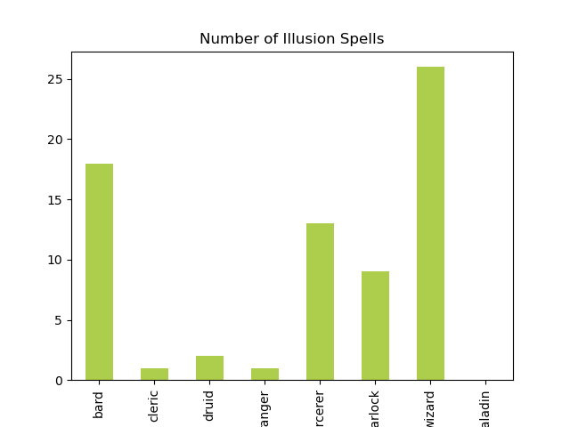
<br>
<br>
<br>
<br>

<br>
<br>
<br>

<br>
<br>
<br>
Below is a comparison between the different spell schools grouped by class. 
<br>
<br>

<br>
Click [here](assets/images/combined_graph.png) for a larger view. 
<br>
<br>
To create these graphs, the code pulls only the rows containing abjuration spells, gathers the rest of the data for those rows, counts how many rows there are for each class, and sorts those data, yielding a dataframe that can be used to create a graph of how many spells of each school each class has:

```
abjuration = classSpellLists['Spell School'] == 'abjuration'
abjurationClassSchool = classSpellLists[abjuration].value_counts('Class').sort_index()
```

Again,  to create a dataframe that re-combines all of these data into the basis for a multiple bar graph setting the eight graphs alongside each other, the function ```pd.merge``` is used.
<br>
<br>

To further explore the question of which schools of magic are concentrated among a smaller number of classes vs. accessible to a wider number, below are a set of graphs showing the schools of spells accessible to exactly one class, accessible to exactly two classes, etc., going all the way up to seven classes (no spells were accessible to all eight casting classes). 
<br>
<br>
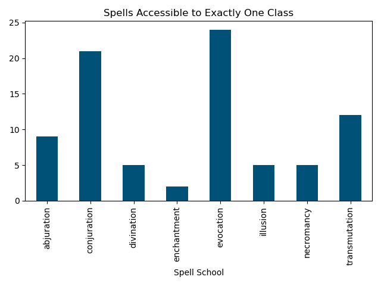
<br>
<br>
Evocation and conjuration spells appear to be by far the most specialized. From data further down the page, we can know that these two spell schools are concentrated in the wizard spell list.
<br>
<br>
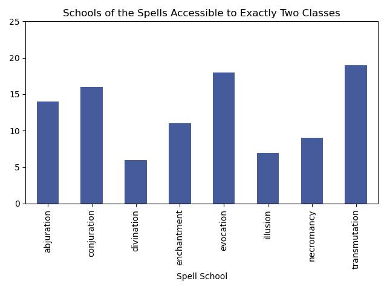
<br>
<br>
<br>
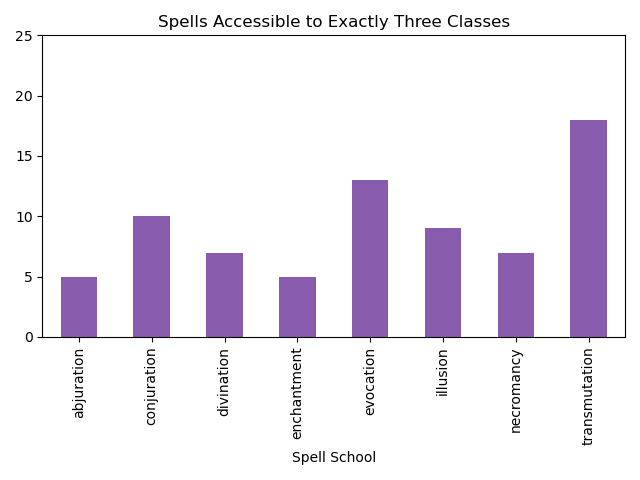
<br>
<br>
This is the last graph that has more than ten spells in any school, with transmutation being the school most commonly available to exactly three classes.
<br>
<br>
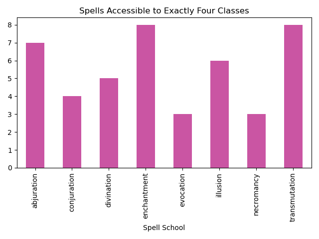
<br>
<br>
Of the spells available to exactly four classes, the schools of transmutation and enchantment the most common, with eight spells of those schools being available to exactly four classes. Abjuration runs a close second, with seven spells. These schools of magic are widespread, but not too widespread.
<br>
<br>
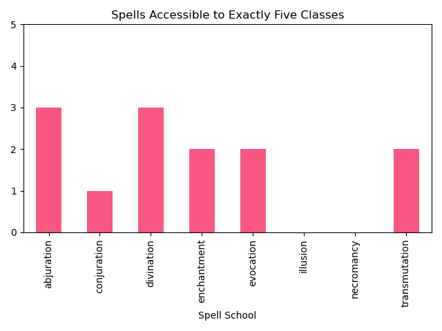
<br>
<br>
<br>
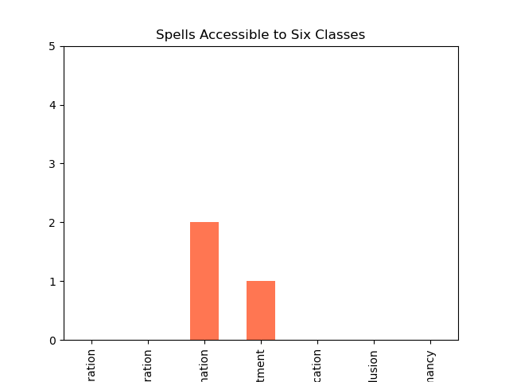
<br>
<br>
There are just three spells available to exactly six classes: two divination and one enchantment.
<br>
<br>
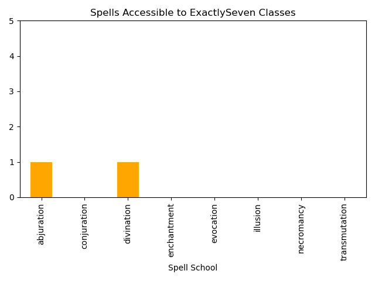
<br>
<br>
And there are just two spells available to seven casting classes: one abjuration spell and one divination spell.
<br>
<br>
This graph sets the data from the above graphs side-by-side, allowing for an overall view of the data. 
<br>
<br>
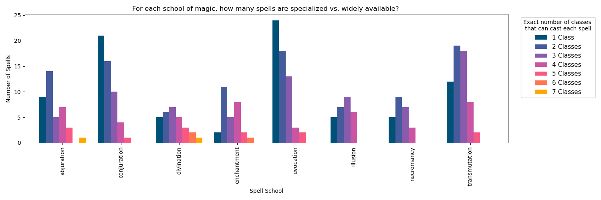
<br>
Click [here](assets/images/allschools_graph.png) for a larger view. 
<br>
<br>

To gather these data, the code counts how many times each spell name occurs in the original dataframe (which has one row for each class for each spell): 

```
numberOfClasses = classSpellLists.value_counts('Spell Name')
```

...yielding the following data, which is then itself counted and sorted.

```
> Spell Name
> Detect Magic         7
> Dispel Magic         7
> Hold Person          6
> Locate Creature      6
> Locate Object        6
>                     ..
> Meld Into Stone      1
> Maze                 1
> Mass Healing Word    1
> Mass Heal            1
> Acid Arrow           1
> Name: count, Length: 319, dtype: int6

classesPerSpell = numberOfClasses.value_counts().sort_index()
```

The code then re-merges the numberOfClasses list with the spell name data and drops superfluous information to leave a dataframe containing spell name, the classes count for each spell, and the school of magic for each spell.

```
combined_df = pd.merge(numberOfClasses, classSpellLists, on='Spell Name')
combined_df = combined_df.drop_duplicates(subset=['Spell Name'])
combined_df = combined_df.drop(columns = ['Class', 'Subclass', 'Spell Level'])
```

It then pulls only the spells available to exactly one class and counts how many there are of each spell school, yielding a dataframe that can be used to create a graph of how many of the spells available to exactly one class belong to each school of magic. 

```
oneclass = combined_df['count'] == 1
oneSchool = combined_df[oneclass].value_counts('Spell School').sort_index()

oneSchoolPlot = oneSchool.plot(kind = "bar", title = "Spells Accessible to Exactly One Class", color = "#005177")
```

It does the same for the rest of the data, again adding in null rows where no data exists.

Here, too, to create a dataframe that re-combines all of these data into the basis for a multiple bar graph setting the eight graphs alongside each other, the function ```pd.merge``` is used. 
<br>

<br>
Click [here](assets/images/allschools_graph.png) for a larger view.

<br>
<br>
Now, the above data explore spell specialization through looking at the *exact* numbers of classes with access to each spell--i.e, the spells to which *only* four classes have access. However, this can also be approached cumulatively for another perspective on the same data. Here, the graphs instead show the *total* number of classes with access to a spell--the spells to which *at least* four classes have access. 

The code is very similar:, but uses ```oneclasstotal = combined_df['count'] >= 1``` in place of ```oneclass = combined_df['count'] == 1```.


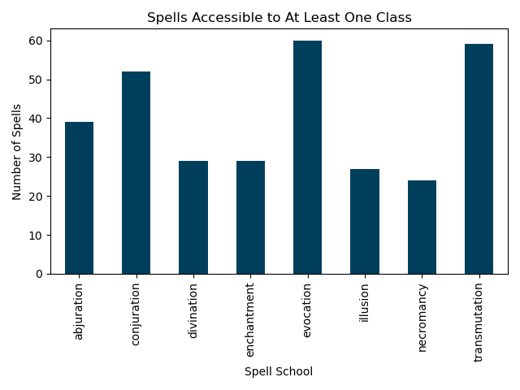
<br>
<br>
Evocation and conjuration spells, the two most specialized spells above, still dominate in number when it comes to which spells are most widely available. However, this graph shows the large number of transmutation spells that exist (and are therefore available to at least one class), indicating that transmutation spells are often less highly specialized and accessible to a wider number of classes.
<br>
<br>
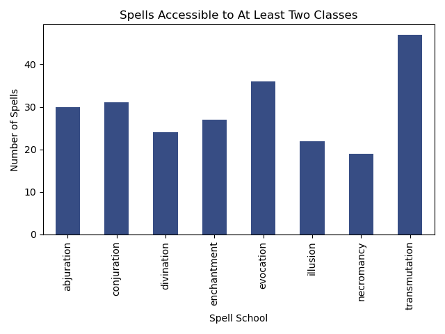
<br>
<br>
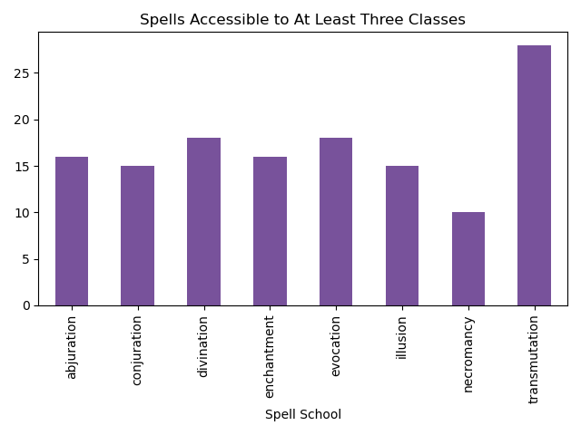
<br>
<br>
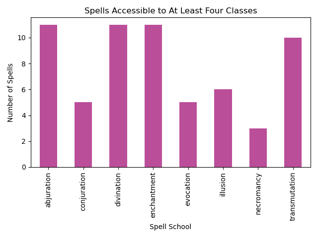
<br>
<br>
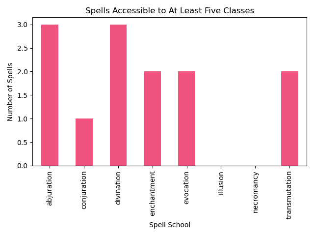
<br>
<br>
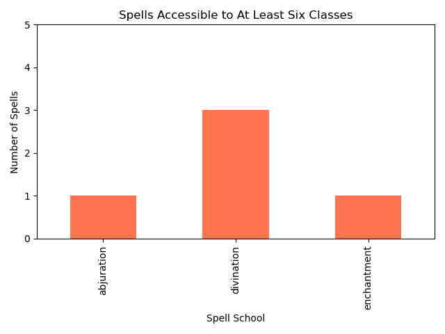
<br>
<br>
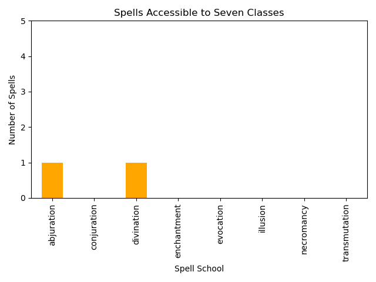
<br>
<br>

## 3. Is there a relationship between spell level and school of magic?
<br>
These graphs show the distribution of spell schools at each spell level.
<br>
<br>
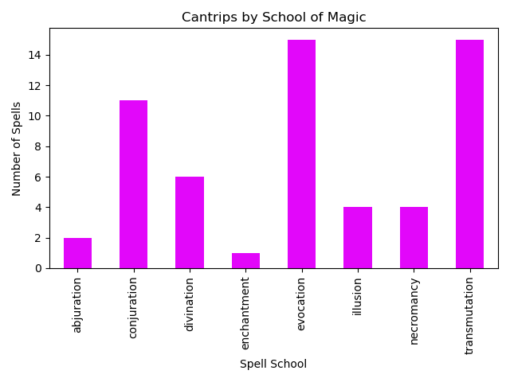
<br>
<br>
There are very few abjuration or enchantment cantrips, and a comparative ton of evocation and transmutation cantrips.
<br>
<br>
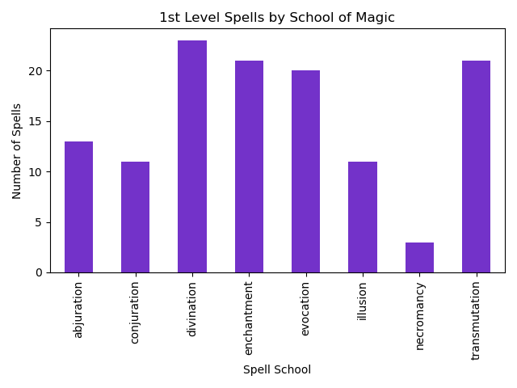
<br>
<br>
Among first-level spells, necromancy has by far the fewest options.
<br>
<br>
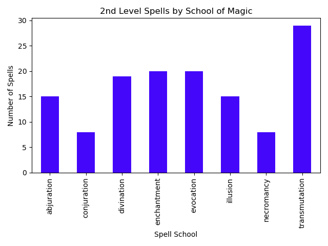
<br>
<br>
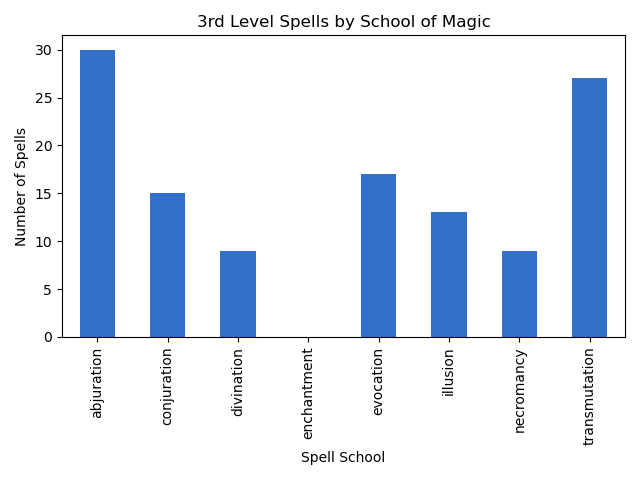
<br>
<br>
There are no third-level enchantment spells at all.
<br>
<br>

<br>
<br>
<br>
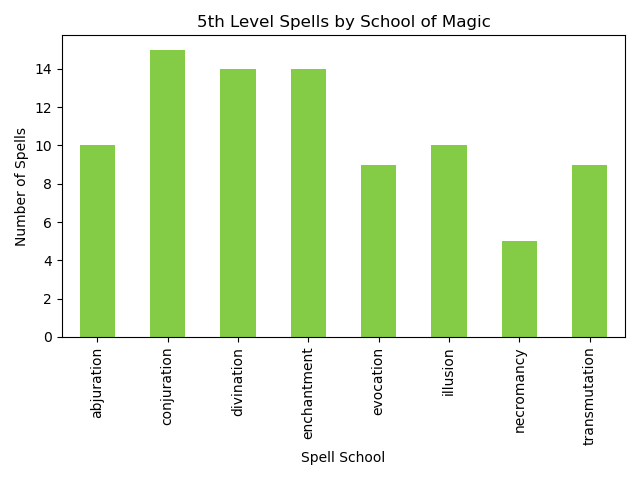
<br>
<br>
<br>
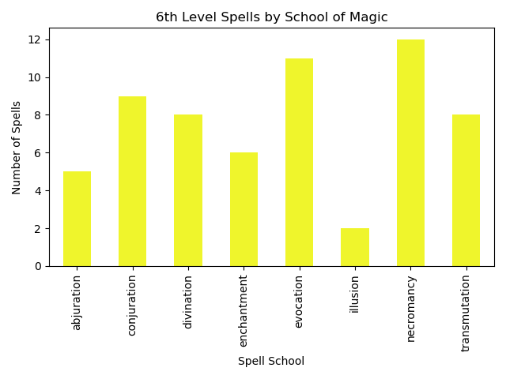
<br>
<br>
At higher levels, the comparative number of necromancy spells starts to climb.
<br>
<br>
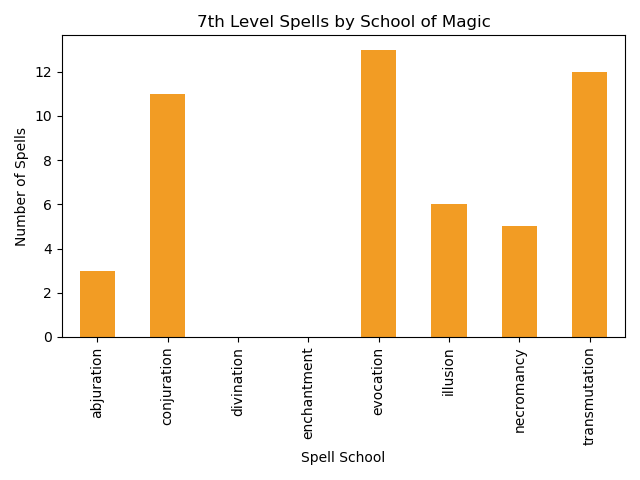
<br>
<br>
There aren't any enchantment spells at seventh level either, nor are there divination spells.
<br>
<br>
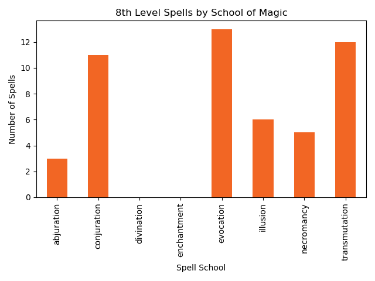
<br>
<br>
This is true again at eighth level.
<br>
<br>
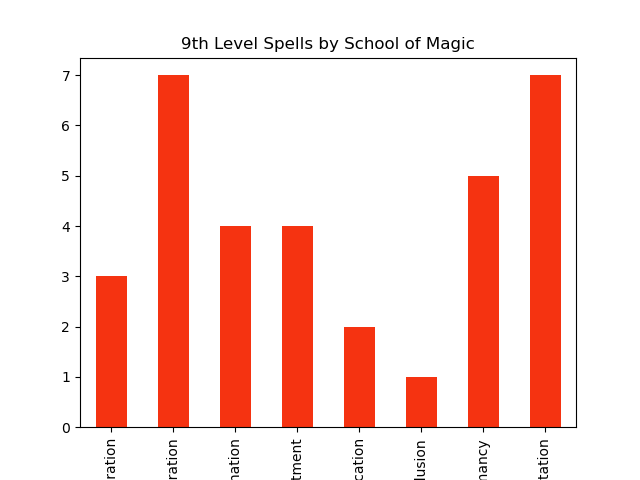
<br>
<br>Yet at ninth level, we again see spells of all schools--even if there is only one illusion spell.
<br>
<br>
To create these graphs, the code pulls only the rows containing cantrips, gathers the rest of the data for those rows, counts how many rows there are for each spell school, and sorts those data, yielding a dataframe that can be used to create a graph of how many spells of each school exist at each spell level:

```
cantrip = classSpellLists['Spell Level'] == 0
cantripSchools = classSpellLists[cantrip].value_counts('Spell School').sort_index()
```

Again,  to create a dataframe that re-combines all of these data into the basis for a multiple bar graph setting the eight graphs alongside each other, the function ```pd.merge``` is used.

Below is a version that shows the distribution of the spells in each class. 
<br>
<br>
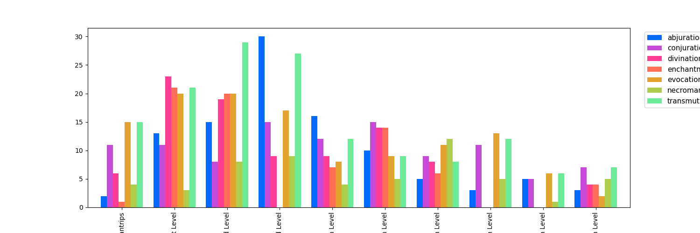
<br>
Click [here](assets/images/all_lvls_graph.png) for a larger view. 

